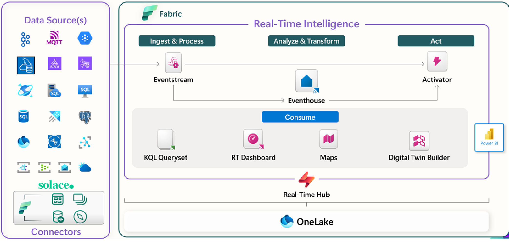
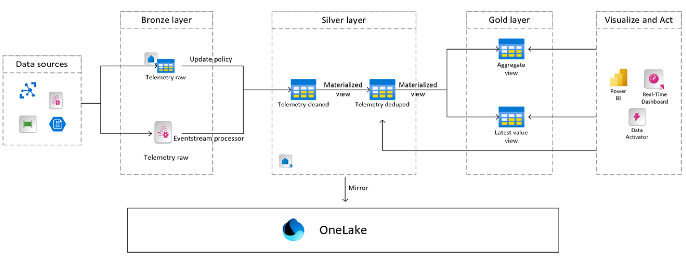

# Implementing Real-Time intelligence using MongoDB CDC Connector for Fabric Eventstream

This sample demonstrates an end-to-end real-time data ingestion and analytics pipeline using:

- **Microsoft Fabric Eventstream**
- **MongoDB CDC Connector for Eventstream**
- **Fabric Eventhouse (KQL database)**
- **Medallion Architecture (Bronze → Silver → Gold)**
- **Update Policies**
- **KQL Materialized Views**
- **Fabric Real-Time Dashboards**

The demo simulates a real-world **Insurance Claims Processing** scenario where updates in a MongoDB database flow through Fabric in real time to power fraud analytics, exposure tracking, and claims operations dashboards.

This repository includes:

- Full KQL scripts for Bronze, Silver, and Gold layers  
- Eventstream configuration guidance  
- A Python-based synthetic data generator for MongoDB  
- Architecture diagrams  
- A structured, repeatable demo flow  
- A fully documented step-by-step setup guide  


## Architecture

This demo implements a full end-to-end **Real-Time Medallion Architecture** using MongoDB Atlas CDC and Microsoft Fabric Real-Time Intelligence. The design enables high‑throughput event ingestion, low-latency transformations, and real‑time analytics dashboards.

### 🔶 High-Level Data Flow

**MongoDB Atlas (Change Streams) → Eventstream (CDC Connector) → Fabric Eventhouse (KQL Database) → Bronze → Silver → Gold → Real-Time Dashboard**

The core components of the pipeline are:

1. **MongoDB Atlas**
   - Hosts the operational “claims” collection
   - Emits *insert*, *update*, and *replace* events via **Change Streams**
   - Pre/Post Images enabled for full CDC state capture

2. **Fabric Eventstream**
   - Uses the **MongoDB CDC connector**
   - Streams documents from MongoDB in real time
   - Provides transformations, data preview, and runtime diagnostics
   - Publishes into Fabric Eventhouse

3. **Fabric Eventhouse (KQL DB) – Bronze Layer**
   - Ingests raw CDC envelopes
   - Stores full Debezium-style “before/after” payloads
   - Append‑only table: `claims_raw_tbl`

4. **Silver Layer – Clean & Enriched**
   - Uses an **Update Policy** on Bronze to trigger the transform
   - Extracts record-level fields
   - Normalizes ISO timestamps
   - Produces clean schema in `claims_silver_tbl`

5. **Gold Layer – Business Aggregates**
   - Three Materialized Views:
     - **High Fraud Events (1‑minute)**
     - **Exposure by Region (15‑minute window)**
     - **Claims Closed per Hour**
   - Each MV automatically updates as Silver receives new events

6. **Fabric Real-Time Dashboard**
   - Reads materialized views directly
   - Auto‑refreshing tiles show real‑time trends:
     - Fraud spikes
     - Financial exposure
     - Operational efficiency

---

### 🔷 Architecture Diagram (Fabric Real-Time Intelligence Pipeline)



---

### 🔷 Medallion Architecture (Bronze → Silver → Gold)

This demo implements the **Real-Time Medallion pattern** using Eventhouse + Update Policies.

- **Bronze** — Raw CDC documents (full payload, no cleanup)  
- **Silver** — Cleaned, typed, normalized events  
- **Gold** — Aggregations and business KPIs (materialized views)  

Each layer is automated using **update policies**, keeping the system continuous and low-latency.

### Medallion Architecture (Bronze → Silver → Gold)


---

## 1. Prerequisites

### MongoDB Atlas on Azure

You need a MongoDB Atlas cluster deployed on Azure with the following requirements:

- The cluster must be accessible from your workstation IP address.
- A database user with **admin privileges** is required for administrative tasks.

### 1.1 Set up MongoDB Atlas Database and Collection

Create the following database and collection in MongoDB Atlas:

- **Database:** `claims-CDC-demo`
- **Collection:** `claims`

#### Sample JSON Document

The following sample document represents an event related to an insurance claim:

```json
{
  "_id": { },
  "eventId": "evt-602bedcb-cc34-405b-9ac0-a9085c2a8016",
  "claimId": "CLM-100004",
  "eventType": "ClaimClosed",
  "eventTimestamp": "2026-01-12T17:41:38.834580Z",
  "claimStatus": "Closed",
  "claimAmountDelta": 8087.91,
  "region": "California",
  "fraudScore": 0.96
}
```

### Import Sample Data into MongoDB Atlas

Import the sample data file  
`src/synthetic-data/insurance_claims_8000_iso.json`  
into the MongoDB Atlas `claims` collection using a command-line utility such as **mongoimport**.

Example command (Windows):

```bash
mongoimport --uri "mongodb+srv://<UserName>:<Pwd>@<Atlas-cluster-name>/claims-CDC-demo" \
  --collection claims \
  --type json \
  --file "<LocalFilePath>\insurance_claims_8000_iso.json" \
  --jsonArray
```

### 1.2 Configure Atlas Database Access

Create the following users in MongoDB Atlas:

- **Admin User**
  - Role: `atlasAdmin`
  - Purpose: Used for administrative tasks such as enabling Pre/Post Images.

- **CDC Connector User**
  - Role: `readAnyDatabase`, for example, demo-user
  - Purpose: Used by the MongoDB CDC connector to read data from MongoDB Atlas into Microsoft Fabric.


### 1.3 Network Access

- As of today, the MongoDB CDC connector **does not support Azure Private Endpoint** (support is in progress).
- For proof-of-concept (POC) and testing, use the **IP Allowlist** workaround described in the Microsoft documentation:

  https://learn.microsoft.com/en-us/fabric/real-time-intelligence/event-streams/connect-connecots-in-virtual-network-on-premises


### 1.4 Enable Pre/Post Images (Required for CDC)

Pre/Post Images must be enabled on the collection you want to stream.

1. Use **mongosh** to connect to MongoDB Atlas with an admin user.
2. Run the following commands:

```javascript
use claims-CDC-demo

db.runCommand({
  collMod: "claims",
  changeStreamPreAndPostImages: { enabled: true }
})
```
---
### 1.5 Microsoft Fabric

Ensure the following Microsoft Fabric resources are available:

- A Fabric workspace in **Fabric capacity** or **Trial license** mode, with **Contributor** or higher permissions.
- An **Eventstream** in Microsoft Fabric.  
  If you don’t have one, create an Eventstream before proceeding.
---

## 2. Configure Fabric Eventstream

Once the MongoDB Atlas on Azure environment is ready, the next step is to configure Microsoft Fabric Eventstream to continuously ingest change stream events from the `claims` collection into Fabric.

### 2.1 Create an Eventstream

In your Microsoft Fabric workspace:

1. Select **New → Eventstream**
2. Name the eventstream, for example: claims_cdc_eventstream

### 2.2 Add MongoDB Atlas CDC Source

Inside the Eventstream canvas:

1. Click **Connect Data Sources**
2. Search for Mongo in the search bar and Select **MongoDB (CDC)** connector and click Connect
3. Configure the MongoDB (CDC) Source and the connection, following the steps in the Microsoft documentation https://learn.microsoft.com/en-us/fabric/real-time-intelligence/event-streams/add-source-mongodb-change-data-capture
- **Connection URI:** your Atlas SRV connection string  
- **Database:** `claims-CDC-demo`  
- **Collection:** `claims`  
- **Authentication:** Database user (`demo-user`) created earlier
- **Snapshot:** Use the default setting
  
4.Save the connection

After connecting:
- Eventstream will automatically begin validating the connection.
- You should see live sample events in the **Data Preview** panel.
This confirms the connector is receiving data.


### 2.3 Add Eventhouse (KQL DB) as Destination

Next, add an Eventhouse destination for the Eventstream:

1. In the Eventstream canvas (still in Edit Mode), click **Add Destination**
2. Choose **Eventhouse**
3. Select the default Data Ingestion mode (which is, Event Processing Before Ingestion)
4. Create a new Eventhouse 
5. Select your KQL database
6. Select or create the target table name: claims_raw_tbl
5. Save the configuration


### 2.4 Publish the Eventstream

Click **Publish** at the top right of the Eventstream canvas.

Once published:

- Data starts flowing from MongoDB to Eventhouse immediately
- Incoming CDC events populate the Bronze table: claims_raw_tbl

You can confirm data ingestion by running:

```kql
claims_raw_tbl
| take 10
```

You can exlore the schema and data in the bronze KQL table claims_raw_tbl, here is a sample payload
```json
{"before":null,"after":"{\"_id\": {\"$oid\": \"69672e67463617b095d1a731\"},\"eventId\": \"evt-3d2c9470-4661-455b-a36c-6fafa492aca6\",\"claimId\": \"CLM-100001\",\"eventType\": \"StatusUpdated\",\"eventTimestamp\": \"2026-01-12T19:05:33.834580Z\",\"claimStatus\": \"Under Review\",\"claimAmountDelta\": 11710.95,\"region\": \"Illinois\",\"fraudScore\": 0.94}","updateDescription":null,"ts_ms":1768372677208,"source":{"version":"3.3.1.Final","connector":"mongodb","name":"cdc.mongodb","ts_ms":1768372677208,"snapshot":"true","db":"claims-CDC-demo","sequence":null,"ts_us":"1768372677208057","ts_ns":"1768372677208057639","collection":"claims-demo","ord":-1,"lsid":null,"txnNumber":null,"wallTime":null},"op":"r","transaction":null}
```
---
## 3 — Create Silver Table, Transform Function, and Update Policy

The Silver layer cleans and normalizes the raw CDC payload from the Bronze table, producing a structured, analytics‑ready table that feeds the Gold Materialized Views.

The Silver layer performs:
- JSON unescaping (because MongoDB CDC emits escaped JSON in `after`)
- Schema normalization
- ISO timestamp parsing
- Casting and field extraction
- Appending clean claim events into `claims_silver_tbl`

### 3.1 Create the Silver Table

Create the target Silver table in your Eventhouse KQL database:

```kql
.create table claims_silver_tbl (
  eventId:string,
  claimId:string,
  eventType:string,
  eventTimestamp:datetime,
  claimStatus:string,
  claimAmountDelta:real,
  region:string,
  fraudScore:real
)
```
### 3.2 Create the Silver Transform Function

The MongoDB CDC connector sends escaped JSON inside the `after` field.  
This transformation function ( which I used CoPilot to generate and debug iteratively) performs the following steps:

- Parses the raw CDC payload
- Unescapes the Debezium-style JSON
- Extracts the `after` document fields
- Converts ISO 8601 timestamps using `todatetime()`
- Applies schema mapping for all fields required downstream

```kql
.create-or-alter function claims_silver_transform() {
    claims_raw_tbl
    | extend p = parse_json(tostring(payload))
    | extend a = replace_string(replace_string(tostring(p.after), "\\\"", "\""), "\\\\", "\\")
    | extend doc = parse_json(a)
    | extend eventTimestamp = todatetime(tostring(doc.eventTimestamp))
    | project
        eventId = tostring(doc.eventId),
        claimId = tostring(doc.claimId),
        eventType = tostring(doc.eventType),
        eventTimestamp = eventTimestamp,
        claimStatus = tostring(doc.claimStatus),
        claimAmountDelta = todouble(doc.claimAmountDelta),
        region = tostring(doc.region),
        fraudScore = todouble(doc.fraudScore)
}
```

### 3.3 Create Update Policy (Bronze → Silver)

The Update Policy automatically populates the Silver table whenever new CDC events arrive in the Bronze table.

```kql
.alter table claims_silver_tbl policy update @"
[{
  \"IsEnabled\": true,
  \"Source\": \"claims_raw_tbl\",
  \"Query\": \"claims_silver_transform()\",
  \"IsTransactional\": false
}]
"
```
Once applied:
- New events in `claims_raw_tbl` are automatically transformed
- Clean rows are appended into `claims_silver_tbl`
- Gold materialized views immediately see new data

## 3.4 Backfill Silver Table (One-Time)

The update policy processes only new incoming events.  
To hydrate the Silver table with the historical CDC records already present in the Bronze table, run the following one-time command:

```kql
.set-or-replace claims_silver_tbl <|
claims_silver_transform()
```
### 3.5 Validate Silver Layer

After the update policy is enabled and silver table is backfilled, run:

```kql
claims_silver_tbl
| take 10
```
You should see clean, structured claim events with valid ISO timestamps.

---


## 4 — Create Gold Materialized Views and Build Real-Time Dashboard

The Gold layer contains business-ready aggregations used directly by the Real-Time Dashboard. These views are continuously updated as new claim events flow through the Bronze and Silver layers.

This demo includes three core business KPIs:

1. **High Fraud Events** (1‑minute window)
2. **Exposure by Region** (15‑minute tumbling window)
3. **Claims Closed per Hour**

These represent fraud detection, financial exposure, and operational performance pillars.

## 4.1 Materialized View — High Fraud Events (1-minute)

This MV counts the number of high‑risk claim events where `fraudScore ≥ 0.8` within 1‑minute windows.

```kql
.create-or-alter materialized-view with (backfill=true)
mv_high_fraud_events_1m on table claims_silver_tbl {
    claims_silver_tbl
    | where fraudScore >= 0.8
    | summarize highFraudEvents = count() by ts = bin(eventTimestamp, 1m), region
}
```
## 4.2 Materialized View — Exposure by Region (15-minute tumbling window)

This MV sums the claimAmountDelta over 15‑minute intervals per region.

```kql
.create-or-alter materialized-view with (backfill=true)
mv_amount_exposure_region_15m on table claims_silver_tbl {
    claims_silver_tbl
    | summarize exposure_15m = sum(claimAmountDelta)
        by window = bin(eventTimestamp, 15m), region
}
```
## 4.3 Materialized View — Claims Closed per Hour

This MV tracks the number of claims closed within each hour

```kql
.create-or-alter materialized-view with (backfill=true)
mv_claims_closed_1h on table claims_silver_tbl {
    claims_silver_tbl
    | where eventType == "ClaimClosed"
        or claimStatus == "Closed"
    | summarize claimsClosed = count()
        by hour = bin(eventTimestamp, 1h), region
}
```

## 4.4 Build Real-Time Dashboard

Based on the 3 Materialized views created above, create 3 tiles with the following KQLs and save each of them to a Real-Time Dashboard.

Tile 1 — High Fraud Events per Minute (Fraud ≥ 0.7)
```kql
mv_high_fraud_events_1m
| where ts > ago(30m)
| order by ts asc
```
Tile 2 — Rolling 15‑Minute Exposure (Financial Risk)
```kql
mv_amount_exposure_region_15m
| where window > ago(2h)
| order by window asc
```
Tile 3 — Claims Closed per Hour (Ops Efficiency)
```kql
mv_claims_closed_1h
| where hour > ago(12h)
| order by hour asc
```
